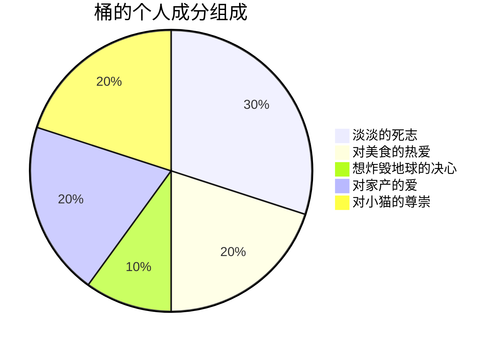

# 关于我

我是桶，在努力成长为一个更坚强、对自己更体贴的人！

博客的header logo来自于这个[捏脸网站](https://www.neka.cc/composer/11809)！
  


* 喜欢小动物，最大的愿望是以后猫狗双全
* 想要学习更多的技术知识，但是真的很懒（呜呜别骂了
* 想要过更加自由的生活
* 想要坚持健身

# 关于此博客

这不是我第一次心血来潮想要写博客了，不过在自己搭建的网站上写还是第一次。希望这次能够一直坚持下去！
这个博客就当作是存放一些平时生活中我无法想他人倾诉或是对这个世界发泄的话语吧~也是我的一个赛博小家 :wave:
